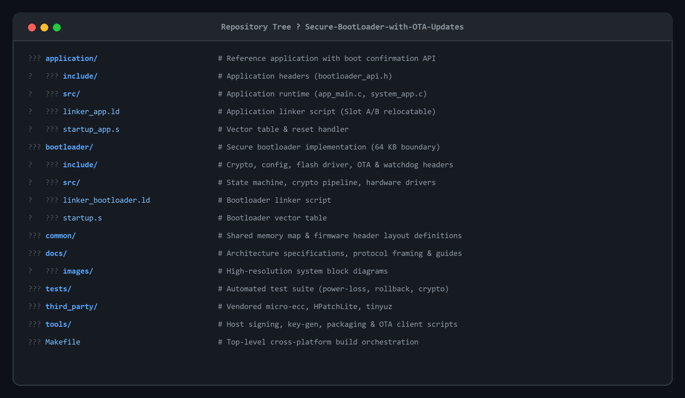
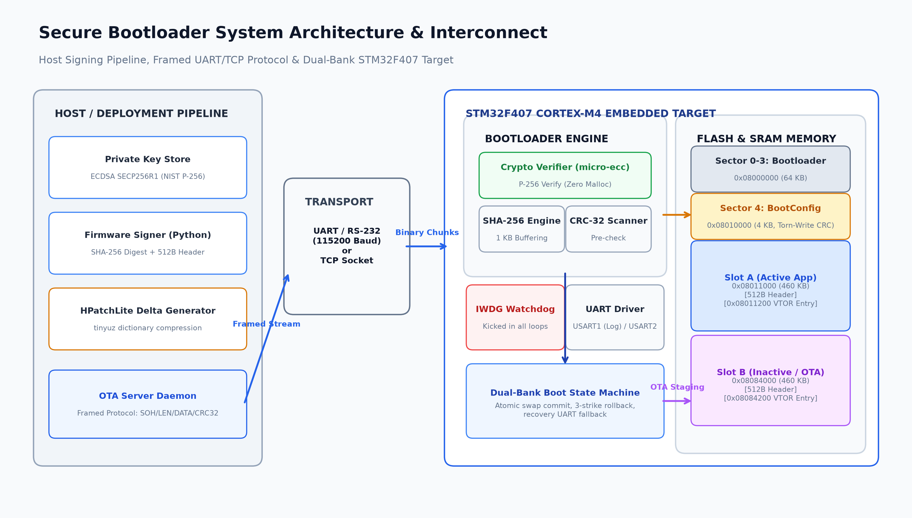
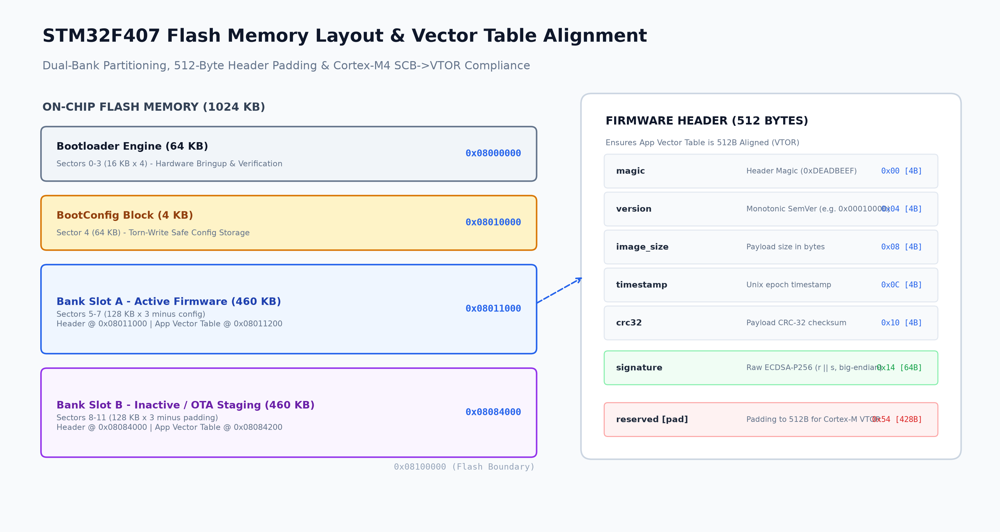
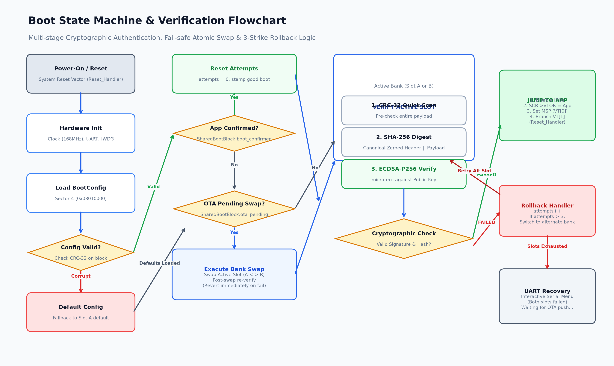

# Secure Dual-Bank Bootloader with OTA (STM32F4)

I built this project to learn how secure boot and in-field firmware updates actually work on bare-metal ARM Cortex-M microcontrollers. It's an A/B dual-bank bootloader targeted at STM32F407 that verifies signed firmware images (ECDSA-P256 + SHA-256) before booting, supports delta updates over UART, and automatically rolls back if an update fails to boot.

> **Status note:** Developed and tested mostly in QEMU simulation (using a simulated flash backend) and Python test harnesses. The low-level flash driver is written against the STM32F4 reference manual (RM0090), but I haven't tested it on physical hardware yet.

---

## Project Structure



---

## System Architecture



### How it works

The firmware images are signed offline using a private key (SECP256R1). During boot, the bootloader verifies the active image before executing it:
1. **CRC-32 pre-check:** Fast sanity check over the payload to reject corrupted downloads immediately.
2. **SHA-256 digest:** Calculated across the header (with the signature field zeroed) and the payload.
3. **ECDSA-P256 verification:** Verified using `micro-ecc`. Signatures are checked for canonical low-S (`s <= n/2`) to prevent signature malleability.
4. **Boot & Execution:** If valid, the bootloader sets the Main Stack Pointer (MSP), points `SCB->VTOR` to the app's vector table, and jumps to the application's `Reset_Handler`.

If an update is flashed and fails to boot (watchdog reset or crash 3 times before confirming boot via the SRAM shared block), the bootloader rolls back to the other bank.

---

## Flash Memory Layout



I split the 1 MB internal flash into two 460 KB slots (Slot A and Slot B), reserving 64 KB for the bootloader and 4 KB (Sector 4) for boot state configuration:

```
0x08000000 ┌─────────────────────────────────────────┐
           │ Bootloader (64 KB, Sectors 0-3)         │
0x08010000 ├─────────────────────────────────────────┤
           │ Boot Configuration (4 KB, Sector 4)     │
0x08011000 ├─────────────────────────────────────────┤
           │ Slot A (460 KB)                         │
           │  ├── 512-byte Firmware Header           │
           │  └── App Vector Table & Code            │
0x08084000 ├─────────────────────────────────────────┤
           │ Slot B (460 KB)                         │
           │  ├── 512-byte Firmware Header           │
           │  └── App Vector Table & Code            │
0x080F7000 ├─────────────────────────────────────────┤
           │ Reserved (36 KB)                        │
0x08100000 └─────────────────────────────────────────┘
```

One detail that took some trial and error was the vector table alignment: Cortex-M requires `SCB->VTOR` to align to a power-of-two boundary based on vector table size (~98 IRQ vectors on STM32F4 means 512-byte alignment). Putting a 512-byte firmware header at the beginning of each slot ensures the application's vector table at `slot_base + 512` is aligned properly without needing extra padding hacks.

---

## Boot State Machine



---

## A few things I struggled with

- **Delta patching without malloc:** Getting HPatchLite and tinyuz working inside the bootloader was tricky. Since dynamic allocation is avoided, all streaming decompression buffers had to fit inside a fixed static buffer pool while reading from the UART stream.
- **Torn writes on flash:** Power loss while writing the boot configuration could corrupt state. I ended up structuring the config write so the CRC word is written last — if power cuts mid-write, the CRC check fails on reboot and the bootloader falls back safely to slot A.
- **ECDSA malleability:** Standard ECDSA allows valid signatures with `(r, -s mod n)`. I added a constant-time check to force `s <= n/2` so an attacker can't alter a signature packet in transit without breaking verification.

---

## What needs work / Known limitations

- **Not tested on real hardware:** The flash driver uses STM32F407 register definitions, but sector erases on real flash take 1-2 seconds for 128 KB sectors. On silicon, the watchdog needs to be refreshed during erase loops, and the ART accelerator cache (`FLASH_ACR`) must be flushed before jumping to newly flashed code.
- **SRAM boot block power loss:** The trial boot counter uses an uninitialized SRAM section (`SharedBootBlock`). It survives soft resets and watchdog timeouts, but a hard power-cut during the first boot trial resets the RAM counters.
- **Hardcoded public key:** The public key is compiled into the bootloader image. In a commercial setup, this would be locked in OTP bytes or protected via flash readout protection (RDP).

---

## Building and Testing

### Prerequisites
- `arm-none-eabi-gcc` toolchain
- `qemu-system-arm` (netduino2 machine target)
- Python 3.10+

### Run the tests
```bash
pip install -r tools/requirements.txt
python tests/run_all.py
```

### Build & run in QEMU
```bash
# Generate keys and build binaries
make keys
make all

# Run bootloader in QEMU
make qemu

# Send full or delta OTA update (in another terminal)
python tools/ota_server.py --full build/app_v2_signed.bin --tcp 127.0.0.1:4444
```

---

## License

MIT License. Third-party libraries used: `micro-ecc` (Ken MacKay), `HPatchLite` (HDiffPatch), and `tinyuz`.
